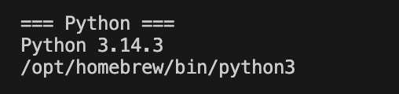
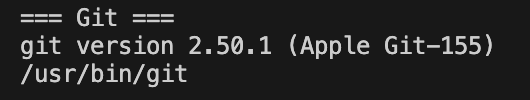

# Init IS310 Homework

## Proof of Installation

1. Python

2. Git

3. VS Code

4. AI Tool/Workflow

I plan to use an AI tool this semester. For more details on how I will use it, please see my [AI Workflow](ai-workflow.md).
