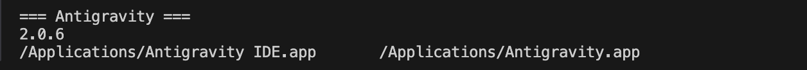

# Init IS310 Homework

**Student:** Min Kim  
**GitHub:** [@lunana-7](https://github.com/lunana-7)  
**Hypothesis Username:** [`lunana-7`](https://hypothes.is/users/lunana-7)  

## Proof of Installation

1. Python

2. Git

3. Antigravity

4. AI Tool/Workflow
I plan to use Antigravity this semester. For more details on how I will use it, please see my [AI Workflow](ai-workflow.md).
